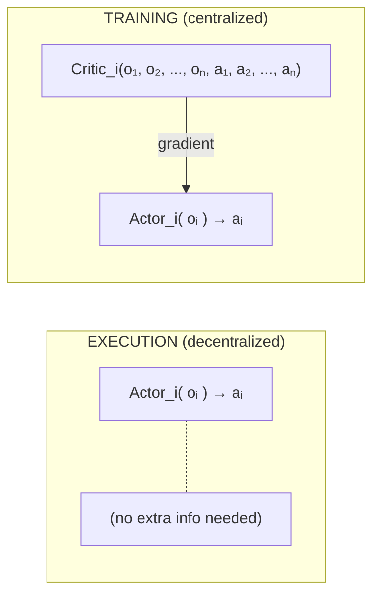

[](https://opensource.org/licenses/MIT)


# Predator-Prey MADDPG Project


## 1. What the Project Demonstrates

The paper's central claim is that **Centralized Training with Decentralized Execution (CTDE)** solves two problems in multi-agent RL:

| Problem | Why it happens | How MADDPG solves it |
|---|---|---|
| **Non-stationarity** | Each agent sees other agents as part of the environment, but their policies keep changing &rarr; the "environment" is non-stationary from any single agent's perspective | The **centralized critic** sees all agents' observations + actions &rarr; stable learning signal |
| **High variance** | Policy gradients in multi-agent settings have variance that grows with # of agents | Centralized critic provides a lower-variance baseline for each agent's policy gradient |

Our project makes this concrete: we train the same predator-prey scenario with MADDPG (centralized critics) and with Independent DDPG (each agent trains alone), then show the difference visually.

<br>

## 2. Conceptual Background

### 2.1 DDPG Recap (single-agent)

DDPG = Deep Deterministic Policy Gradient. An off-policy actor-critic for **continuous** action spaces.

$$
\begin{align*}
\text{Actor } \mu(o) &\rightarrow \text{action } a \quad &&(\text{deterministic policy}) \\
\text{Critic } Q(o, a) &\rightarrow \text{scalar value} \quad &&(\text{estimates expected return})
\end{align*}
$$

Key ingredients:
- **Replay buffer** &nbsp;&nbsp;&nbsp;&nbsp;&nbsp;&nbsp;&nbsp;— store $(o, a, r, o', \text{done})$ transitions, sample mini-batches
- **Target networks** &nbsp;&nbsp;— slowly-updated copies of actor & critic for stable TD targets
- **Soft updates** &nbsp;&nbsp;&nbsp;&nbsp;&nbsp;&nbsp;&nbsp;&nbsp;— the networks get updated stepwise: $$\theta_{\text{target}} \leftarrow \tau \cdot \theta + (1-\tau) \cdot \theta_{\text{target}} \quad \text{with } \tau = 0.01$$
- **Exploration noise** — add Gaussian or Ornstein-Uhlenbeck noise to actions during training

### 2.2 Independent DDPG (baseline)

Each agent $i$ has its own actor $\mu_i(o_i)$ and critic $Q_i(o_i, a_i)$.
- The critic only sees **its own** observation and action
- Other agents look like a non-stationary environment &rarr; training is unstable
- This is our **control group**

### 2.3 MADDPG (the paper's contribution)

Each agent $i$ has its own actor $\mu_i(o_i)$ and a **centralized** critic $Q_i(o_1 \dots o_n, a_1 \dots a_n)$.
- **Training**: the critic gets the joint state $(o_1, \dots, o_n)$ and joint actions $(a_1, \dots, a_n)$ &rarr; stable signal
- **Execution**: the actor only uses its own observation $o_i$ &rarr; no extra info needed at test time
- This is the **CTDE** paradigm



<br>

## 3. Environment: `simple_tag_v3`

This is the **predator-prey** environment from PettingZoo's MPE suite, which is the same family of environments used in the original paper.

### 3.1 The scenario (for first trials, later e.g. more)

| Role | Default count | Goal | Color |
|---|---|---|---|
| **Adversaries** (predators) | 3 | Collide with the "good" agent | Red |
| **Good agent** (prey) | 1 | Evade the adversaries | Green |
| **Obstacles** | 2 | Static landmarks that block movement | Grey |

- The prey is **faster** than individual predators &rarr; predators must **cooperate** to corner it
- This cooperation is exactly what MADDPG enables and Independent DDPG struggles with

### 3.2 Observation space

| Agent type | Observation vector contents | Approx. dim |
|---|---|---|
| Adversary | Own velocity, own position, relative positions of landmarks, relative positions of other agents (adversaries + prey) | ~16 |
| Good agent | Own velocity, own position, relative positions of landmarks, relative positions of adversaries | ~14 |

### 3.3 Action space

With `continuous_actions=True`:
- `Box(0.0, 1.0, shape=(5,))` &rarr; `[no_action, move_left, move_right, move_down, move_up]`
- These are **force magnitudes** applied to the agent

### 3.4 Rewards

| Agent type | Reward signal |
|---|---|
| Adversary | + for colliding with prey, − for distance to prey |
| Good agent | − for being caught by adversaries |

<br>

## 4. Project Structure

```
predator_prey_arena/
├── pixi.toml
├── README.md
│
├── src/                    # Source code directory
│   ├── config.py           # All hyperparameters in one place
│   ├── replay_buffer.py    # Shared replay buffer for joint transitions
│   ├── networks.py         # Actor and Critic neural networks
│   ├── ddpg_agent.py       # Single DDPG agent (actor + critic + target nets)
│   ├── maddpg.py           # MADDPG controller (wraps N agents, centralized critics)
│   ├── independent_ddpg.py # Independent DDPG controller (wraps N agents, local critics)
│   │
│   ├── train.py            # Main training script (runs both variants)
│   ├── evaluate.py         # Load checkpoints &rarr; run episodes &rarr; record GIFs
│   └── plot_results.py     # Plot reward curves from saved logs
│
├── checkpoints/            # Saved model weights
│   ├── maddpg/
│   └── iddpg/
├── results/                # Training logs (CSV/JSON)
│   ├── maddpg_rewards.csv  
│   └── iddpg_rewards.csv
└── gifs/                   # Recorded GIFs
    ├── maddpg_trained.gif
    └── iddpg_trained.gif
```

<br>

---

## [License](#license)
This project is licensed under the **MIT license** - see the file [LICENSE](LICENSE) for details.
